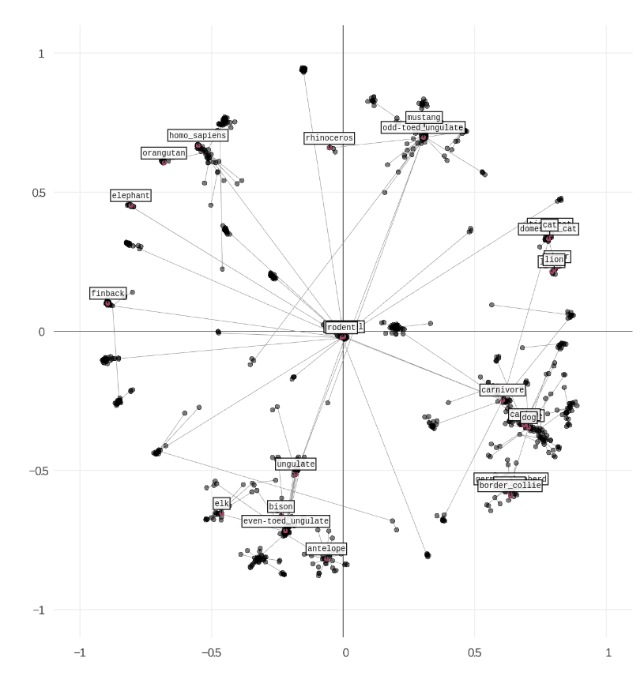

# Implementation of Poincaré embeddings in Keras

* Simple implementation of Poincaré Embedding introduced in the following paper:

* [Maximilian Nickel and Douwe Kiela, "Poincaré Embeddings for Learning Hierarchical Representations'", arXiv preprint arXiv:1705.08039, 2017.](https://arxiv.org/abs/1705.08039)

### Example result generated with provided notebooks

### Checkout notebook for interactive training and plotting of word embeddings

* Run notebook with `jupyter notebook --NotebookApp.iopub_data_rate_limit=10000000` in order to avoid problems with too many data to plot.

### Requirements 

The [requirements.txt](requirements.txt) file.

### Another repository worth to check:

* [TatsuyaShirakawa/poincare-embedding](https://github.com/TatsuyaShirakawa/poincare-embedding) - some parts of the code were based on this repo. 
