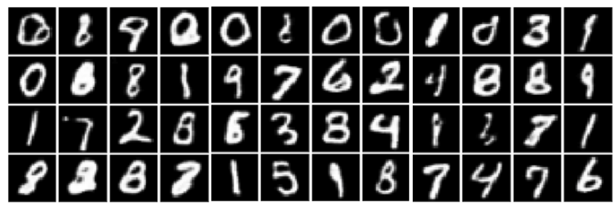
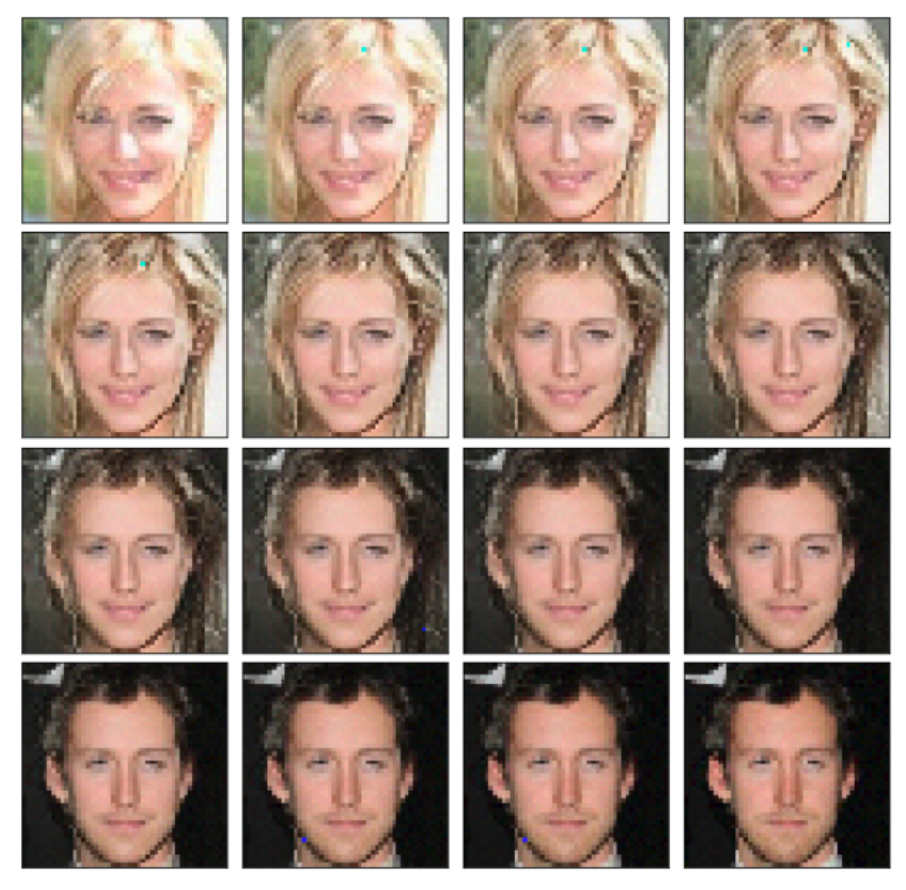
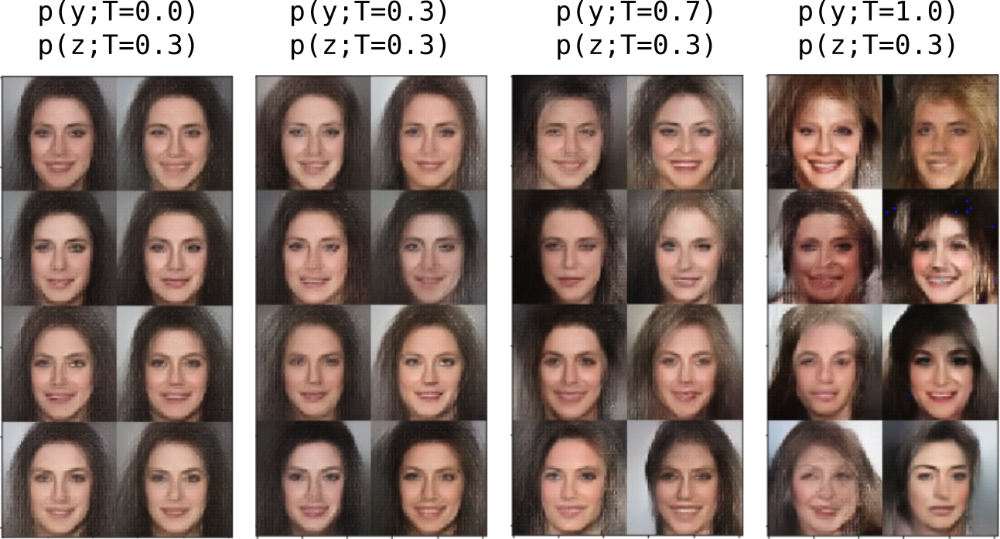

# An implementation of the GLOW paper and simple normalizing flows lib

This code is suppose to be easy to read, experiment and extend,
see example results below.

## References

* The code is based on paper: [GLOW](https://github.com/openai/glow)
* The content of the tf_ops.py is copied from their repository.

## Requirements for code and experiments

The code was tested with:

* tensorflow==1.8.0
* other libraries: matplotlib, numpy, tqdm, pytest etc

Celeba and MNIST experiments (see notebooks) were trained on single
machine with single GTX1080 graphics card. A quick profiling showed that
GPU is not fully utilized in term of computation, so improving data
loading may improve speed of training.

### CelebA dataset

[*CelebA*](http://mmlab.ie.cuhk.edu.hk/projects/CelebA.html), download
`img_align_celeba.zip` from the Dropbox link on this
[page](http://mmlab.ie.cuhk.edu.hk/projects/CelebA.html) under the
link *Align&Cropped Images* in the *Img* directory and `list_eval_partition.txt`
under the link *Train/Val/Test Partitions* in the *Eval* directory. Then do:

**Important:** Script celeba_formatting.py used for formatting dataset
can be found at: [tensorflow/models/research/real_nvp](https://github.com/tensorflow/models/tree/master/research/real_nvp)

The instruction below is copied from their page:
```shell
mkdir celeba
cd celeba
unzip img_align_celeba.zip
```

We'll format the training subset:
```shell
python ../models/real_nvp/celeba_formatting.py \
    --partition_fn list_eval_partition.txt \
    --file_out celeba_train \
    --fn_root img_align_celeba \
    --set 0
```

Then the validation subset:
```shell
python ../models/real_nvp/celeba_formatting.py \
    --partition_fn list_eval_partition.txt \
    --file_out celeba_valid \
    --fn_root img_align_celeba \
    --set 1
```

And finally the test subset:
```shell
python ../models/real_nvp/celeba_formatting.py \
    --partition_fn list_eval_partition.txt \
    --file_out celeba_test \
    --fn_root img_align_celeba \
    --set 2
```

## Results:

### MNIST

* Samples from MNIST model

  

### CelebA

* Example interpolation for 48x48 images

  

* CelebA 64x64 model. The effect of the temperature on samples (see discussion in the text)

  

* Same as above but different temperatures for factorized p(z) is set.
  Setting small temperature to the p(z) allowed to use T=1 to the latent
  variable which is suppose to keep image information.

  


## A normalizing flow high level library

### Notebooks

* Notebooks contain a ready to train models for MNIST and CelebA
datasets
* Each notebook should run around ~2h on GTX1080 (~11GB of GPU RAM)
* The profiling showed that the bottleneck is data preprocessing and
loading. During training of CelebA 64x64 version I had 40% of GPU
usage.

### Layers:

A flow layer defines the forward and backward normalizing flow. All
layers are implemented in [flow_layers](./flow_layers.py) file. For
example usage you can take a look into the corresponding test file.

### Creating a simple flow:

Here is an example of simple but not useful flow definition.

* Define model:
    ```python
    import flow_layers as fl
    import nets
    # openAI shallow network used for affine coupling layer
    shift_and_log_scale_fn = nets.OpenAITemplate().create_template_fn("NN")

    layers = [
        fl.QuantizeImage(num_bits=5),
        fl.SqueezingLayer(),
        fl.ActnormLayer(),
        fl.InvertibleConv1x1Layer(),
        fl.AffineCouplingLayer(shift_and_log_scale_fn)
        fl.FactorOutLayer()
    ]

    model = fl.ChainLayer(layers, name="simple_model")
    ```
* Define input:
    ```python
    batch_size = 16
    images_ph = tf.placeholder(tf.float32, [batch_size, 64, 64, 3])
    flow = fl.InputLayer(images_ph)
    output_flow = model(flow, forward=True)
    y, logdet, z = output_flow
    ```
* Define loss:
    ```python
    import tensorflow as tf
    tfd = tf.contrib.distributions

    y_flatten = tf.reshape(y, [batch_size, -1])
    z_flatten = tf.reshape(z, [batch_size, -1])

    # define prior
    prior_y = tfd.MultivariateNormalDiag(
        loc=tf.zeros_like(y_flatten),
        scale_diag=tf.ones_like(y_flatten)
    )
    prior_z = tfd.MultivariateNormalDiag(
        loc=tf.zeros_like(z_flatten),
        scale_diag=tf.ones_like(z_flatten)
    )

    # compute logp(y) and logp(z)
    log_prob_y = prior_y.log_prob(y_flatten)
    log_prob_z = prior_z.log_prob(z_flatten)

    # compute all terms
    loss = log_prob_y + log_prob_z + logdet

    # we add minust "-" since we minimize mle instead of
    # maximizing it
    mle_loss = - tf.reduce_mean(loss)
    ```
* Define optimizer and train model
    ```python
    optimizer = tf.train.AdamOptimizer(0.001)
    train_op = optimizer.minimize(mle_loss)
    ```

### Creating a GLOW model

* There is pre-made wrapper for the GLOW architecture, there may
be minor differences between my implementation and the paper one, but
those should not affect the results significantly.
    ```python
    sess = tf.InteractiveSession()
    images_ph = tf.placeholder(tf.float32, [16, 64, 64, 3])
    layers, actnorm_layers = nets.create_simple_flow(
        num_steps=32, # same as K
        num_scales=4,  # same as L parameter
        template_fn=nets.OpenAITemplate(width=512)
    )
    flow = fl.InputLayer(images_ph)
    model = fl.ChainLayer(layers)
    # forward flow
    output_flow = model(flow, forward=True)
    # backward flow
    reconstruction = model(output_flow, forward=False)
    # flow is a tuple of three tensors
    x, logdet, z = flow

    # Initialize actnorm layers with Data Dependent Initialization (DDI)
    sess.run(tf.global_variables_initializer())
    beta_ph = tf.placeholder(tf.float32, [])
    nets.initialize_actnorms(
        sess,
        feed_dict_fn=lambda: {beta_ph: 1.0},
        actnorm_layers=actnorm_layers,
        num_steps=10,
)
    ```
* Then define the cost and the optimizer and train model.
* `actnorm_layers` contains a list of `ActnormLayer's` and can be used
  for data dependent initialization.

### Tests

The code is partially tested, run `pytest` to check for possible errors.
